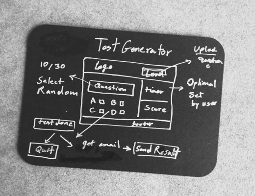

# Project Idea
## Test Generator

## Requirements
* Upload Test Questions
* Generate 10 Random Question
* Option to set the timer
* Option to quit/reset
* Process and score the questioner 
* Option to email the result 
 

## JavaScript / Interactive web page
## Commit rules
* CA   > Code Added
* CE   > Code Edited
* CF   > Code Fixed
* DT   > Developer Test
* DI   > Integration Test (N/A)
* UT   > User Test
* MD   > documentaion notes

### Notes for documentation
* using GRID Layout to maintain responsivity

### Fixes
* 404 page not working
* adjust contact form margins/padding relative to the grid structure

### Maby Later!
#### Extra Navigation Button

   <!-- <button class="x-button" id="x1-button" onclick="testSrats">click here to start</button>
                        tag button vs unput ?!!! 
                    -->

                    <!-- <button class="x-button" id="x2-button" onclick="showAnswers">Show the correct answer</button> -->

                    <!-- Learn Mode Only -->
                    <!-- 
                    <button class="x-button" id="y1-button" onclick="goNext">Go to the next question</button>
                    <button class="x-button" id="y2-button" onclick="goBack">Go to the previous question</button>
                    <button class="x-button" id="y3-button" onclick="bookMark">Go to the next question</button>
                 -->
                    <!-- 
                    [TBD IDEAS FOR NEXT PROJECTS]
                    Bookmarks: go to next/previous/last/first
                    Generate tests out of book marks
                    Generate tests out of mistakes
                    Option to save the test and resume later  <> via user account or via download and upload!  
                -->
